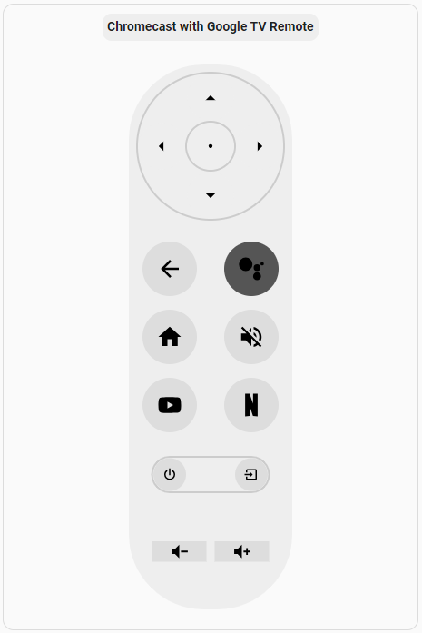

# Chromecast with Google TV Remote Card
[](https://github.com/hacs/integration)
[](https://www.buymeacoffee.com/schilea)

Chromecast with Google TV Remote Card (CCwGTVRemoteCard) is a custom web component designed to act as a virtual remote control for Google TV. It integrates with Home Assistant to control Android TV devices, allowing you to navigate the interface, adjust the volume, and launch apps like YouTube and Netflix.

This component leverages the Home Assistant Android TV Remote integration for seamless control of your Google TV or Android TV device.

## Prerequisites
Before you can use the Chromecast with Google TV Remote Card (CCwGTVRemoteCard), you need to set up the Android TV Remote integration in Home Assistant:

Set up the Home Assistant Android TV Remote Integration https://www.home-assistant.io/integrations/androidtv_remote/. 

This integration allows you to control Android TV or Google TV devices via Home Assistant. Follow the official documentation to configure the integration.

Ensure your Chromecast with Google TV is properly integrated and working in Home Assistant, with the ability to send commands like up, down, select, volume_up, and others.

## Screenshot



## Features
- Dynamic UI: The remote control layout is drawn on an HTML canvas with a responsive design.
- Interactive Buttons: Supports directional controls (D-Pad), media buttons, volume, power, and more.
- Home Assistant Integration: Easily trigger Home Assistant services when buttons are pressed.
- Icon Preloading: All icons are preloaded for a smooth user experience.
- Visual Feedback: Button press actions include a fading effect for better UX.
- Scalable Layout: Adjustable scale to fit different display sizes and configurations.

## Installation
You can install CCwGTVRemoteCard either manually or automatically via HACS.

### 1. Automatic Installation via HACS
If you use the Home Assistant Community Store (**HACS**), follow these steps for an easy installation:

1. Open **HACS** in your Home Assistant dashboard.
2. Go to **Frontend**.
3. Click the three dots (**⋮**) in the upper-right corner, and choose Custom Repositories.
4. Add this repository URL: **https://github.com/schilea/ccwgtv-remote-card** and select **Dashboard** as the category.
5. Once added, search for **Chromecast with Google TV Remote Card** in the HACS store and click Install.
6. After installation, go to **Settings** > **Dashboards** > Click the three dots (**⋮**) in the upper-right corner > **Resources** in Home Assistant.
7. Check if the resource was automatically installed
8. If not, Click the + **Add Resource** button.
9. Add the following URL and select JavaScript Module as the resource type:
  ```yaml
/hacsfiles/ccwgtv-remote-card/ccwgtv-remote-card.js
  ```
10. Restart Home Assistant to apply the changes.

### 2. Manual Installation
1. Download the latest release from the Releases page **https://github.com/schilea/ccwgtv-remote-card**.
2. Place the **.js** file in your Home Assistant **www/community/cwgtv-remote-card** folder.
3. Add the following to your **lovelace** resources in the **configuration.yaml** file:
  ```yaml
resources:
  - url: /www/community/cwgtv-remote-card/ccwgtv-remote-card.js
    type: module
  ```
### Configure the Remote Card
Once the card is installed, add it to your **Lovelace** dashboard by creating a custom card with the following configuration:

#### Configuration Options
- **title**: The title of the card.
- **scale**: Adjust the size of the remote (default: 1.0, range: 0.5 to 1.5).
- **Button Mappings**: Define the action for each button using the Home Assistant domain, service, and service_data.

#### Available Buttons
- **D-Pad**: up, down, left, right, select
- **Control Buttons**: back, home, assistant, volume_mute, youtube, netflix
- **Power Buttons**: power, input
- **Volume**: volume_up, volume_down

#### How to Use
Add the card to your Lovelace dashboard with the necessary button mappings.
The component will render a Google TV remote control.
Clicking on a button triggers the corresponding action in your Home Assistant instance.

#### Example of Lovelace Custom Card
  ```yaml
type: custom:ccwgtv-remote-card
title: Chromecast with Google TV Remote
scale: 1.5
up:
  domain: remote
  service: send_command
  service_data:
    entity_id: remote.ccwgtv
    command: DPAD_UP
down:
  domain: remote
  service: send_command
  service_data:
    entity_id: remote.ccwgtv
    command: DPAD_DOWN
left:
  domain: remote
  service: send_command
  service_data:
    entity_id: remote.ccwgtv
    command: DPAD_LEFT
right:
  domain: remote
  service: send_command
  service_data:
    entity_id: remote.ccwgtv
    command: DPAD_RIGHT
select:
  domain: remote
  service: send_command
  service_data:
    entity_id: remote.ccwgtv
    command: DPAD_CENTER
back:
  domain: remote
  service: send_command
  service_data:
    entity_id: remote.ccwgtv
    command: BACK
assistant:
  domain: remote
  service: send_command
  service_data:
    entity_id: remote.ccwgtv
    command: SEARCH
home:
  domain: remote
  service: send_command
  service_data:
    entity_id: remote.ccwgtv
    command: HOME
volume_mute:
  domain: remote
  service: send_command
  service_data:
    entity_id: remote.ccwgtv
    command: MUTE
youtube:
  domain: remote
  service: turn_on
  service_data:
    entity_id: remote.ccwgtv
    activity: vnd.youtube.launch://
netflix:
  domain: remote
  service: turn_on
  service_data:
    entity_id: remote.ccwgtv
    activity: com.netflix.ninja
power:
  domain: remote
  service: toggle
  service_data:
    entity_id: remote.ccwgtv
input:
  domain: media_player
  service: select_source
  service_data:
    entity_id: media_player.living_room_tv
    source: LiveTV
volume_down:
  domain: remote
  service: send_command
  service_data:
    entity_id: remote.ccwgtv
    command: VOLUME_DOWN
volume_up:
  domain: remote
  service: send_command
  service_data:
    entity_id: remote.ccwgtv
    command: VOLUME_UP
  ```

#### Limitations

1. **ASSISTANT** button on this custom remoe card will open Chromecast **SEARCH** menu, similar as pressing **search** button on Chromecast Voice Remote.

2. There is no mapping in Android TV Remote for **INPUT** button. Instead, the above configuration will use media_player command to switch to source LiveTV on corresponding TV entity where Chromecast is connected.
   
Depending on TV vendor, commands from TV official integration can be used.

LG WebOS integration https://www.home-assistant.io/integrations/webostv/ example for calling button commands **EXIT** or **MENU**:
  ```yaml
input:
  domain: webostv
  service: button
  service_data:
    entity_id: media_player.media_player.living_room_tv
    button: EXIT
  ```
3. **VOLUME** buttons (MUTE, UP, DOWN) are working only if the Chromecast **Volume Control** is set to Chromecast (Chromecast > **All Settings** > **Remotes & Accessories** > **Set up remote buttons** > **Volume control** > **Chromecast** ).
   
5. If the Chromecast **Volume Control** is set to a different option (like **TV IR**), commands are not working with TV, but you can set the **VOLUME** buttons **UP** and **DOWN** to control directly the TV via media_player command. Not valid for **MUTE** where media_player command works only if curent state is known.
  ```yaml
volume_down:
  domain: media_player
  service: volume_down
  service_data:
    entity_id: media_player.living_room_tv
volume_up:
  domain: media_player
  service:  volume_up
  service_data:
    entity_id: media_player.living_room_tv
  ```
6. Alternativelly, commands for TV official integration can be used.
   
LG WebOS integration https://www.home-assistant.io/integrations/webostv/ example for calling button commands **MUTE**, **VOLUMEDOWN**, **VOLUMEUP**:
  ```yaml
volume_mute:
  domain: webostv
  service: button
  service_data:
    entity_id: media_player.living_room_tv
    button: MUTE
volume_down:
  domain: webostv
  service: button
  service_data:
    entity_id: media_player.living_room_tv
    button: VOLUMEDOWN
volume_up:
  domain: webostv
  service: button
  service_data:
    entity_id: media_player.living_room_tv
    button: VOLUMEUP
  ```
## Development
To contribute or extend the project:

Clone the repository: git clone https://github.com/schilea/ccwgtv-remote-card.git

Make your changes.

Test within Home Assistant by adding the modified .js file to the www folder.


## License
This project is licensed under the MIT License. See the LICENSE file for details.

<a href="https://www.buymeacoffee.com/schilea" target="_blank"></a>
